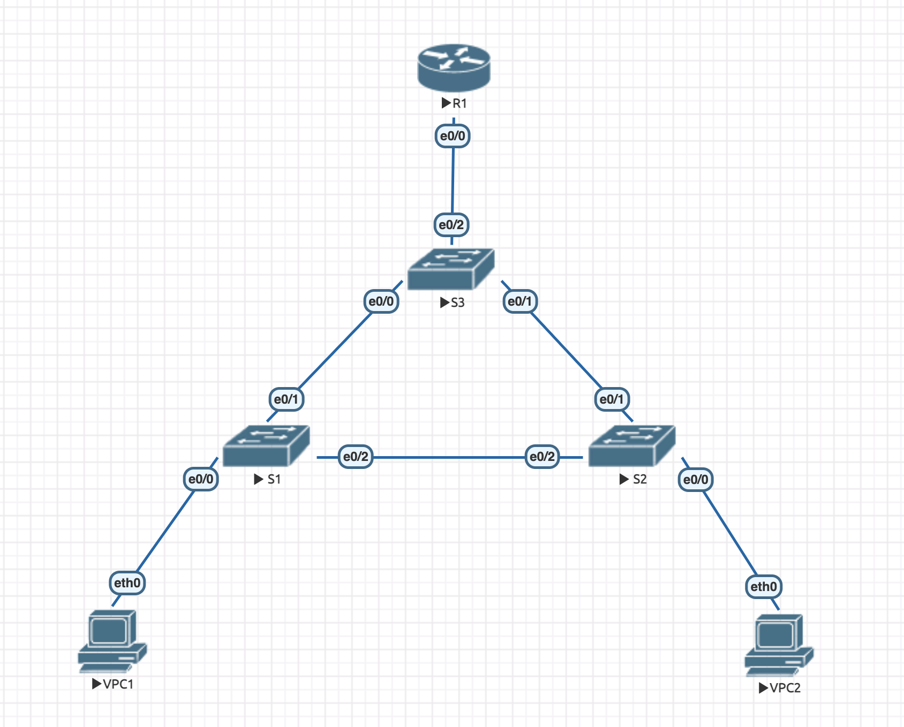

# hw1

## Навигация

* ### [Конфигурация](configs/)
* ### [Лабораторная](lab-1.unl/)

## Топология



## Проверка доступности

```
VPCS> ping 10.0.10.2 -c 2

10.0.10.2 icmp_seq=1 ttl=64 time=0.001 ms
10.0.10.2 icmp_seq=2 ttl=64 time=0.001 ms
```

```
VPCS> ping 10.0.20.2 -c 2                  

10.0.20.2 icmp_seq=1 ttl=64 time=0.001 ms
10.0.20.2 icmp_seq=2 ttl=64 time=0.001 ms
```
