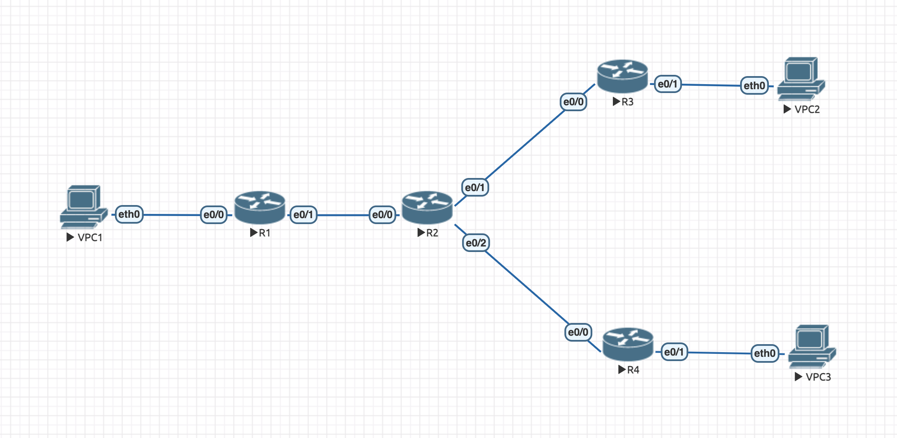

# hw3

## Навигация

* ### [Конфигурация](configs/)
* ### [Лабораторная](lab-4.unl/)

## Топология



### Мои источники

* [Настройка GRE туннеля на Cisco](https://wiki.merionet.ru/seti/22/nastroyka-gre-tunnelya-na-cisco/)

### Проверка доступности

```
VPCS> ping 10.0.20.2

84 bytes from 10.0.20.2 icmp_seq=1 ttl=62 time=13.598 ms
84 bytes from 10.0.20.2 icmp_seq=2 ttl=62 time=7.132 ms
84 bytes from 10.0.20.2 icmp_seq=3 ttl=62 time=4.625 ms
84 bytes from 10.0.20.2 icmp_seq=4 ttl=62 time=6.399 ms
84 bytes from 10.0.20.2 icmp_seq=5 ttl=62 time=6.614 ms
```


```
VPCS> ping 10.0.30.2

84 bytes from 10.0.30.2 icmp_seq=1 ttl=62 time=9.876 ms
84 bytes from 10.0.30.2 icmp_seq=2 ttl=62 time=8.472 ms
84 bytes from 10.0.30.2 icmp_seq=3 ttl=62 time=11.056 ms
84 bytes from 10.0.30.2 icmp_seq=4 ttl=62 time=9.478 ms
84 bytes from 10.0.30.2 icmp_seq=5 ttl=62 time=6.446 ms
```

